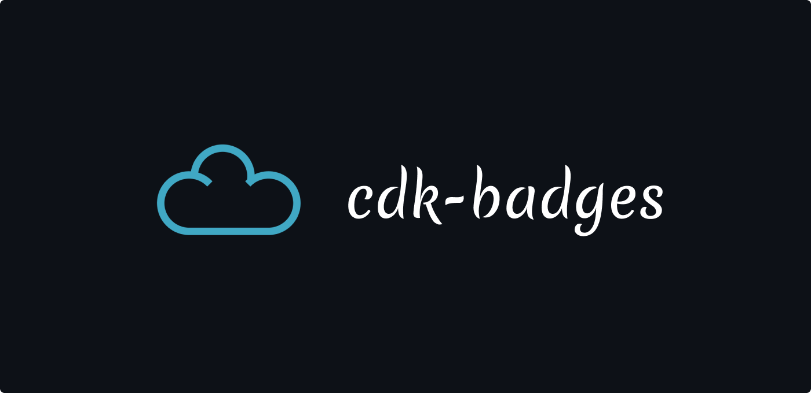
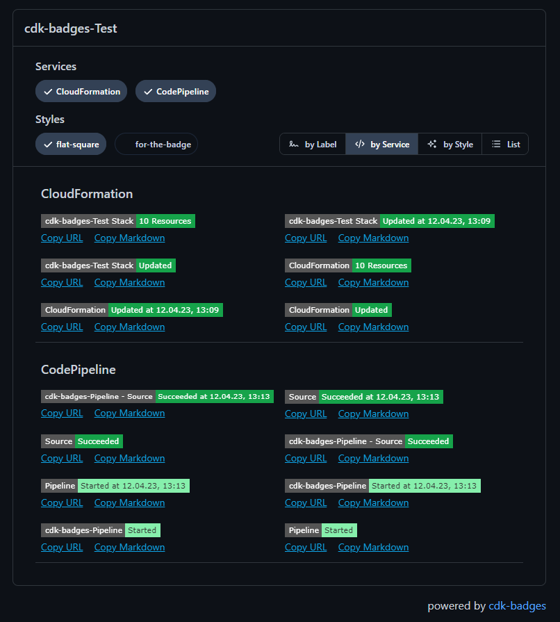

[](https://github.com/NimmLor/cdk-badges)

[](https://npmjs.com/package/cdk-badges)


Generate badges for your cdk applications. Badges are created via eventbride events that invoke a lambda function that writes the badge to a s3 bucket.

## Installation

```bash
yarn add cdk-badges
```

## Usage

Generate Badges for your cloudformation stacks.

```ts
new CdkBadges(stack, 'Badges', {
  additionalCfnStacks: [],
  badgeStyle: 'flat-square',
  cacheControl: 'max-age=300',
  localization: {
    hour12: false,
    locale: 'de-AT',
    showSeconds: false,
    timezone: 'Europe/Vienna',
  },
})
```

## Features

- [x] Generate badges for your stacks
- [x] View all available badges in a web ui
- [ ] Generate badges for aws codepipeline
- [ ] Generate badges for aws codebuild
- [ ] Add option to add cloudfront in front of the s3 bucket
- [ ] Add option to add a custom domain

### Available Badges

- Cloudformation stack status
- Cloudformation resource count

### Web UI

The web ui shows all available badges in the specified s3 bucket. It can be accessed via the cloudformation output.

[](https://github.com/NimmLor/cdk-badges)
